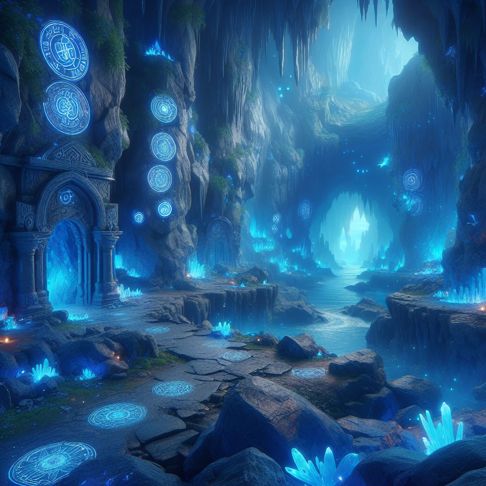

# Astro Starter Kit: Basics

## Install dependencies

```bash
npm install
```

### Run the project

```bash
npm run dev
```

## A new way to experience learning

The idea is to have an engine capable of generating experiences where the user can interact with the content, making it more dynamic and engaging.



## Features

Components for:

- [x] Inventory, to store items
- [x] Modals, to display information
- [x] Item, that you can pick up
- [x] Navigate, to move between scenes
- [x] Slug, rendering a level

## How to use

The game is created by adding information to assets directory.

## Adding an item

There's two things you need to do to add an item:

- Add an item to **items.json**
- Add the item to a level in **levels.json** entry in the *items* array


**items.json**, this is where you add items, here's an example:

```json
{
    "id": 1,
    "name": "Chest",
    "description": "The chest before you is a sight to behold, exuding an aura of malevolence. Its surface is crafted from dark, weathered wood, marred by deep scratches and scars that tell tales of a sinister past. Iron bands, rusted and twisted, wrap around the chest, securing it with an almost skeletal grip.The chest's lock is a grotesque face, its mouth agape in a silent scream, with the keyhole positioned where its tongue should be. The face appears almost lifelike, as if it could start moving at any moment. The entire chest radiates an aura of dread, making you hesitate to approach it, yet its sinister allure is impossible to ignore.",
    "type": "container",
    "url": "chest.png",
    "items": [3]
}
```

**levels.json**, this is where you add scenes, here's an example:

```json
{
    "id": 3,
    "name": "Level 3 - The bridge to nowhere",
    "description": "There's a narrow bridge that leads to a door on the other side of the room. The bridge looks old and rickety, but it's the only way forward.",
    "url": "/3",
    "item": "4",
    "next": "1",
    "image": "bridge.png"
}
```

An image needs to exist in public/images directory with the same name as the url property.

## Demo

